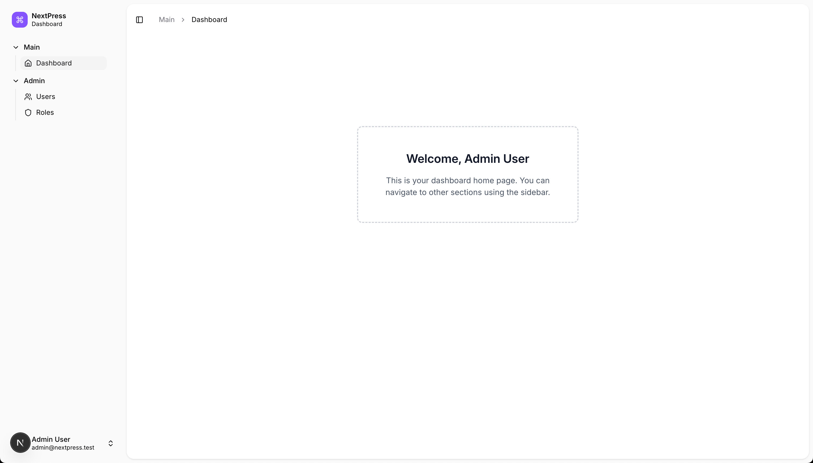

<p align="center">
  
  <h3 align="center">NextPress</h3>
  <p align="center">Express + Next.js Monorepo Starter Template</p>
</p>

## 🚀 **Production-Ready Fullstack Template**

A modern fullstack TypeScript template featuring **Next.js 15**, **Tailwind CSS v4**, **Shadcn UI**, complete authentication, and advanced developer tooling.

This template includes a **Turborepo monorepo** with:
- **Backend API** (`apps/api`) - Express.js with TypeScript + JWT Auth
- **Frontend Web** (`apps/web`) - Next.js 15 + Shadcn UI + TanStack Query
- **Shared Package** (`packages/shared`) - Common types and utilities
- **Turborepo** for build optimization and advanced caching
- **Complete Auth System** - Login, register, dashboard, protected routes

### 📁 **Project Structure:**
```
nextpress/
├── apps/
│   ├── api/                    # Express.js backend API
│   └── web/                    # Next.js frontend application
├── packages/
│   └── shared/                 # Shared types, utilities, API contracts
├── turbo.json                  # Turborepo configuration
├── pnpm-workspace.yaml         # Workspace configuration
├── tsconfig.base.json          # Base TypeScript configuration
└── package.json                # Root workspace package
```

---

## 🔑 **Key Features:**

### **Backend API (`apps/api`):**
- [Express.js](https://expressjs.com/) with full TypeScript support
- [TypeORM](https://typeorm.io/) with SQLite (auto-generates) for zero-config development
- JWT Authentication with [Passport.js](http://www.passportjs.org/) strategies
- Bearer token + httpOnly cookie dual auth support for REST clients
- [EJS](https://ejs.co/) templating for server-rendered pages
- Logging ([Winston](https://github.com/winstonjs/winston) + [Morgan](https://github.com/expressjs/morgan))
- Request validation ([Express Validator](https://express-validator.github.io/))
- Background job processing ([BullMQ](https://docs.bullmq.io/))
- Queue monitoring dashboard ([Bull Board](https://github.com/felixmosh/bull-board))
- Security headers ([Helmet](https://helmetjs.github.io/))
- CORS configuration for cross-origin authenticated requests
- Rate limiting for API endpoints

### **Frontend Web (`apps/web`):**
- [Next.js 15](https://nextjs.org/) with App Router
- [TypeScript](https://www.typescriptlang.org/) for type safety
- [Tailwind CSS v4](https://tailwindcss.com/) with CSS-first configuration
- [Shadcn UI](https://ui.shadcn.com/) components with Radix UI primitives
- [TanStack Query](https://tanstack.com/query) for server state management
- [React Hook Form](https://react-hook-form.com/) with Zod validation
- JWT + Cookie authentication with protected routes
- Auth-aware navigation and redirects
- Type-safe API client with shared types
- Server-side rendering and static generation

### **Shared Package (`packages/shared`):**
- Common TypeScript types and interfaces
- API request/response type definitions
- Shared utilities and helper functions
- End-to-end type safety between frontend and backend

### **Authentication & UI Features:**
- **Complete auth flow**: Login, register, dashboard with protected routes
- **Guest route protection**: Auto-redirect logged-in users from auth pages
- **Auth context**: Centralized authentication state management
- **Modern forms**: React Hook Form with Zod validation and error handling
- **Card-based UI**: Clean, modern design with Shadcn UI components
- **Auth-aware navigation**: Dynamic navbar based on authentication status
- **Responsive design**: Mobile-first with Tailwind CSS utilities

### **Development Experience:**
- **Turborepo** for fast, cached builds with advanced caching
- **Hot reload** across all applications
- **pnpm workspaces** for efficient dependency management
- **Unified testing** with Jest
- **Type safety** across the entire stack
- **CSS-first theming** with design tokens and CSS variables

---

## 📱 **Screenshots:**

### **HomePage**
<p align="center">
  
</p>

### **Authenticated Dashboard**
<p align="center">
  
</p>

*Full-stack authentication with JWT cookies, user profile data from `/api/v1/me` endpoint, modern Shadcn UI components*

---

## 🏁 **Getting Started:**

### **Prerequisites:**
- Node.js 18+ and pnpm installed
- Redis server (for sessions and job queues)
- *No database setup required - SQLite auto-generates on first run*

### **Setup:**

1. **Clone the repository:**
   ```bash
   git clone <your-repo-url>
   cd nextpress
   ```

2. **Install dependencies:**
   ```bash
   pnpm install
   ```

3. **Start development:**
   ```bash
   # Start both API and web apps
   pnpm run dev

   # Or start individually
   pnpm run dev:api    # API server (http://localhost:3000)
   pnpm run dev:web    # Web app (http://localhost:3001)
   ```

---

## 🤖 **Available Commands:**

### **Workspace Commands (Root Level):**
```bash
# Development
pnpm run dev                    # Start all apps in development mode
pnpm run dev:api               # Start only API server
pnpm run dev:web               # Start only web application

# Building
pnpm run build                 # Build all apps and packages
pnpm run build:api             # Build only API
pnpm run build:web             # Build only web app

# Testing
pnpm run test                  # Run all tests
pnpm run test:api              # Run only API tests

# Database operations (API)
pnpm run migrate               # Run migrations
pnpm run migrate:rollback      # Rollback last migration
pnpm run migrate:make          # Create new migration
pnpm run entity:make           # Create new entity

# Utilities
pnpm run clean                 # Clean all build artifacts
pnpm run typecheck             # Type-check all packages
pnpm run fmt                   # Format API code
```

### **API-Specific Commands:**
```bash
# Using Turborepo filters
turbo run dev --filter=@repo/api
turbo run migrate --filter=@repo/api
turbo run test --filter=@repo/api

# Database operations
turbo run migrate --filter=@repo/api              # Run migrations
turbo run migrate:rollback --filter=@repo/api     # Rollback last migration
turbo run migrate:make --filter=@repo/api         # Create new migration
turbo run entity:make --filter=@repo/api          # Create new entity
```

### **Web App Commands:**
```bash
turbo run dev --filter=@repo/web        # Next.js dev server
turbo run build --filter=@repo/web      # Build for production
turbo run start --filter=@repo/web      # Start production server
turbo run lint --filter=@repo/web       # Lint code
```

---

## 📦 **Adding Dependencies:**

### **Add to API app:**
```bash
pnpm add express-validator --filter @repo/api
pnpm add @types/express-validator --filter @repo/api --save-dev
```

### **Add to Web app:**
```bash
pnpm add axios --filter @repo/web
pnpm add @types/node --filter @repo/web --save-dev
```

### **Add to Shared package:**
```bash
pnpm add lodash --filter @repo/shared
pnpm add @types/lodash --filter @repo/shared --save-dev
```

### **Add workspace-wide tools:**
```bash
pnpm add -w prettier eslint    # Adds to root package.json
```

---

## 🚀 **Deployment:**

### **Quick Deploy to Vercel (Frontend Only):**
```bash
# Deploy the Next.js frontend from monorepo root
npx vercel --prod

# Uses vercel.json configuration to properly build workspace dependencies
# The API will run as Express server separately

# Note: Deploy from monorepo root, not from apps/web directory
# This ensures proper resolution of @repo/shared workspace dependencies

# If you encounter pnpm lockfile issues, temporarily use:
# "installCommand": "pnpm install --no-frozen-lockfile" in vercel.json
```

### **Full-Stack Deployment Options:**

#### **Option 1: Separate Deployments**
- **Frontend**: Deploy `apps/web` to Vercel/Netlify
- **Backend**: Deploy `apps/api` to Railway/Render/Heroku
- **Database**: Use managed SQLite (Turso) or PostgreSQL

#### **Option 2: Single Platform**
- **Render**: Deploy both as services with shared database
- **Railway**: Full-stack deployment with PostgreSQL
- **Self-hosted**: Docker containers with docker-compose

#### **Option 3: Serverless (Advanced)**
- Convert Express routes to Vercel API routes
- Use Vercel Postgres or PlanetScale
- Deploy as single Next.js app with API routes

### **Environment Variables for Production:**
```bash
# Frontend (.env)
NEXT_PUBLIC_API_URL=https://your-api-domain.com

# Backend (.env)
NODE_ENV=production
JWT_SECRET=your-super-secure-jwt-secret
APP_PORT=3000
DB_CLIENT=postgres  # or sqlite for simple deployments
DATABASE_URL=your-production-database-url
```

### **Troubleshooting Vercel Deployment:**

#### **Common Issues:**

1. **pnpm lockfile outdated:**
   - ✅ **Already configured** - Using `--no-frozen-lockfile` in `vercel.json`
   - This allows Vercel to resolve dependency updates automatically

2. **Database migration errors during build:**
   - ✅ **Automatically handled** - Migrations are skipped on Vercel
   - The API postinstall script detects Vercel environment and skips database setup

3. **Missing SQLite dependencies:**
   - ✅ **Already included** - `sqlite3` is now a production dependency

4. **Missing workspace script errors:**
   - ✅ **Already configured** - Using `pnpm -w run build:web` for workspace context

---

## 🏗️ **Architecture & Tech Stack:**

### **Modern Stack:**
- **Frontend**: Next.js 15 + React 18 + TypeScript
- **Styling**: Tailwind CSS v4 with CSS-first configuration
- **UI Components**: Shadcn UI + Radix UI primitives
- **Forms**: React Hook Form + Zod validation
- **State Management**: TanStack Query for server state
- **Authentication**: JWT + httpOnly cookies with dual support
- **Backend**: Express.js + TypeScript + TypeORM
- **Database**: SQLite (auto-setup) / PostgreSQL (production)
- **Build System**: Turborepo with advanced caching
- **Package Manager**: pnpm workspaces

### **Architecture Decisions:**

### **API-First Design:**
- The **API app** handles all backend logic, database operations, and authentication
- Clean RESTful endpoints for frontend consumption
- Server-side rendering capabilities with EJS templates

### **Frontend-Only Web App:**
- **Next.js app** focuses purely on frontend concerns
- Communicates with API via HTTP requests
- Type-safe API client using shared type definitions

### **Shared Types:**
- API request/response interfaces in `packages/shared`
- End-to-end type safety from database to UI
- Single source of truth for data contracts

---

## 🛡️ **Security & Authentication Features:**

### **Authentication System:**
- **Dual auth support**: Bearer tokens for REST clients + httpOnly cookies for web
- **Protected routes**: Automatic redirects for authenticated/guest-only pages
- **Secure JWT**: HttpOnly cookies with SameSite protection
- **Auth context**: Centralized state management with React Context
- **Auto logout**: Handles token expiration gracefully

### **API Security:**
- **Helmet.js** for security headers
- **Rate limiting** on API endpoints (100 req/15min general, 5 req/15min auth)
- **CORS** configuration with credential support
- **Input validation** with express-validator and Zod
- **Error handling** with configurable debug mode
- **Request logging** for security monitoring

---

## 🧪 **Testing:**

- **Jest** for unit and integration testing
- **Supertest** for API endpoint testing
- **Global test setup** with database cleanup
- **TypeScript** support in tests
- Run tests: `pnpm run test:api`

---

## 🔄 **Development Workflow:**

1. **Start development servers:**
   ```bash
   pnpm run dev    # Starts both API (3000) and web (3001)
   ```

2. **Make changes to shared types:**
   - Edit files in `packages/shared/src/`
   - Both API and web apps get updated types automatically

3. **Add new API endpoints:**
   - Create in `apps/api/src/controllers/`
   - Add type definitions to `packages/shared/src/api/`
   - Use in web app with type-safe API client

4. **Database changes:**
   ```bash
   pnpm run migrate:make    # Create migration
   pnpm run migrate         # Apply migrations
   ```

---

## 📝 **Key Highlights:**

- **Modern Frontend**: Next.js 15 with App Router and React 18
- **Advanced Styling**: Tailwind CSS v4 with CSS-first configuration
- **Component System**: Shadcn UI with Radix UI primitives
- **Complete Authentication**: Full auth flow with protected routes and context
- **Server State**: TanStack Query for efficient data management
- **Form Handling**: React Hook Form with Zod validation
- **Zero Config**: SQLite auto-setup for instant development
- **Flexible Auth**: Supports both web cookies and REST API tokens
- **Type Safety**: End-to-end TypeScript across the entire stack
- **Fast Builds**: Turborepo with advanced caching and hot reload
- **Production Ready**: Deployment configurations for major platforms

---

## 🤝 **Contributing:**

Do you have a significant feature in mind? [Create an issue](https://github.com/tanmaymishu/express-ts-starter/issues/new) or [send a pull request](https://github.com/tanmaymishu/express-ts-starter/pulls).

### **Adding New Apps:**
```bash
mkdir apps/mobile
cd apps/mobile
npm init -y
# Configure as needed
```

### **Adding New Packages:**
```bash
mkdir packages/ui-components
cd packages/ui-components
npm init -y
# Add to pnpm-workspace.yaml
```

---

**Happy coding! 🚀**
